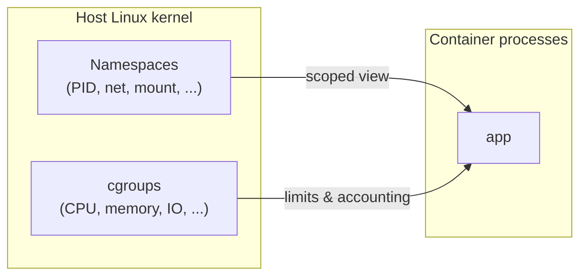
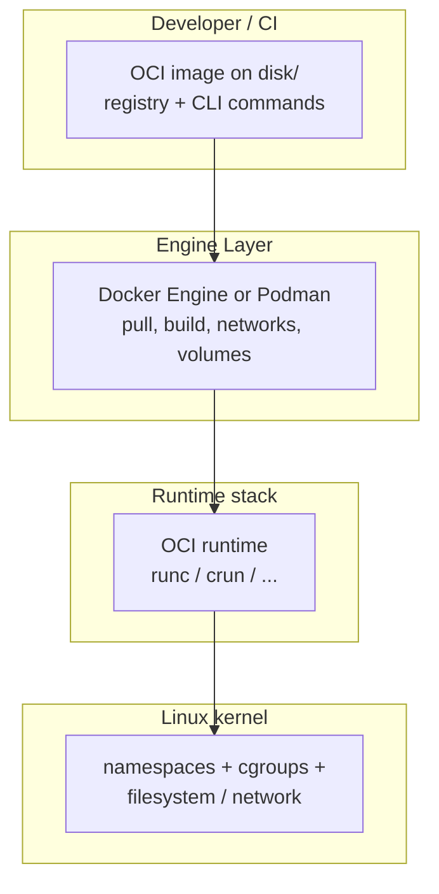
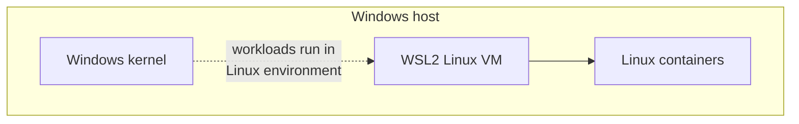
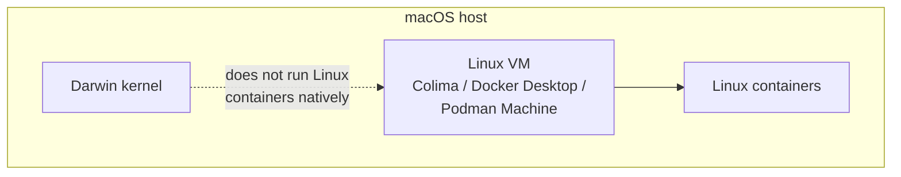
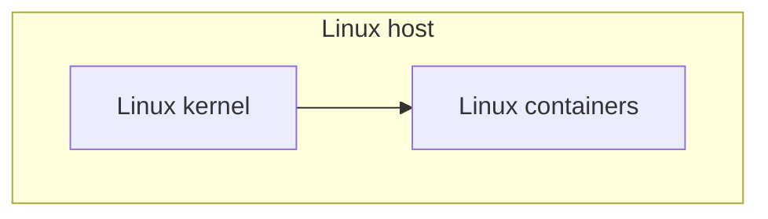

# Module 1 — What containers are (kernel and OCI)

## Learning outcomes

After this module you can explain:

- Why containers are **Linux-kernel features** (on typical “Docker” workloads), not magic files.
- How **namespaces** and **cgroups** provide isolation and resource limits.
- What **OCI** specifies and how **runtimes** and **engines** differ.

---

## 1. The short truth

When people say “container,” they usually mean:

> A **process (or group of processes)** running with **extra kernel isolation**, using **restricted views** of the system (namespaces) and **optional resource accounting/limits** (cgroups), started from a **filesystem bundle** that looks like a minimal Linux distro (the image rootfs).

That model is implemented in the **Linux kernel**. Other operating systems either run Linux containers **inside a Linux layer** or use different technologies (Windows containers exist but are a separate topic; this course focuses on the mainstream Linux-container stack).

---

## 2. Namespaces (what the process can *see*)

Linux **namespaces** partition kernel-visible resources so one group of processes does not see another’s resources. Examples:

| Namespace | Effect (simplified) |
|-----------|---------------------|
| **PID** | Process IDs are scoped; PID 1 inside the namespace is not the host’s PID 1. |
| **Mount** | Filesystem mount table is scoped; `/` inside the container is not the host `/`. |
| **Network** | Network interfaces, routing, and ports can be separate (often with a virtual Ethernet pair to the host). |
| **UTS** | Hostname. |
| **IPC** | SysV IPC, POSIX message queues (isolation between apps). |
| **User** | Maps user/group IDs so “root” inside may be unprivileged on the host (rootless). |
| **Cgroup** | (Cgroup namespace) Limits what cgroup paths a container sees. |

**Key idea:** namespaces **change the view**, not necessarily the privilege. A “privileged” container can still be dangerous because it relaxes isolation. Rootless containers use **user namespaces** plus other restrictions to reduce host impact.

The diagram below contrasts **visibility** (namespaces) with **consumption limits** (cgroups): both attach to processes the host kernel schedules.

---

## 3. cgroups (what the process may *consume*)

**cgroups** (control groups) account for and limit resources: CPU, memory, I/O, PIDs, etc. Modern Linux uses **cgroup v2** (or hybrid setups during transitions).

**Key idea:** cgroups enforce **fairness and ceilings** (“this group may use at most 512 MiB RAM”). Together with namespaces, you get something that *behaves* like a lightweight VM for many workloads—but it shares the **host kernel**.

---

## 4. Images, layers, and the OCI

The **Open Container Initiative (OCI)** defines:

- **Image spec** — how image metadata and layers are structured.
- **Runtime spec** — how a runtime starts a container from an **OCI bundle** (config + rootfs).

An **image** is a stack of mostly read-only layers plus a writable top layer when the container runs (often “copy-on-write” with **overlay** filesystems).

**Runtime** examples: `runc`, `crun`, `youki` — low-level “start this bundle.” **Engine** examples: **Docker Engine** (`dockerd` + containerd), **Podman** (daemonless, often uses `crun`/`runc` under the hood) — higher-level UX: pull, build, network, volumes.

Typical layering (conceptual—not every install exposes every box):

---

## 5. “Docker” vs “container”

- **Container** = kernel isolation + bundle + lifecycle.
- **Docker** (the company/ecosystem) popularized the UX and tooling; compatible tools (Podman, etc.) can consume **OCI images** and run **OCI runtimes**.

---

## 6. Platform map (preview)

| Host OS | Where Linux containers execute | Typical bridge to your CLI |
|---------|----------------------------------|----------------------------|
| **Linux** | Directly on the host kernel | `docker` / `podman` talking to local engine or directly to runtime stack |
| **macOS** | Inside a **Linux VM** (or remote Linux) | Docker Desktop VM, Colima VM, Podman Machine, remote Engine |
| **Windows** | **WSL2** Linux VM, or Linux VM via Hyper-V, or remote Linux | Docker Desktop WSL2 backend, Podman in WSL2, etc. |

Modules 2–3 expand this with tooling.

The three cases are **stacked below** (each diagram is its own figure) so they read top-to-bottom instead of side-by-side: **Windows**, then **macOS**, then **Linux**.

**Windows host**

**macOS host**

**Linux host**

### Remote Linux (any laptop OS)

---

## 7. Check your understanding

1. Why is a Redis “Linux container” not the same idea as a macOS `.app` bundle running natively?
2. What is the difference between a **namespace** limitation and a **cgroup** limit?
3. Name one OCI runtime and one “engine” that sits above it.

---

## Further reading (optional)

- Linux man pages: `namespaces(7)`, `cgroups(7)`.
- OCI specifications: [opencontainers.org](https://opencontainers.org/)
