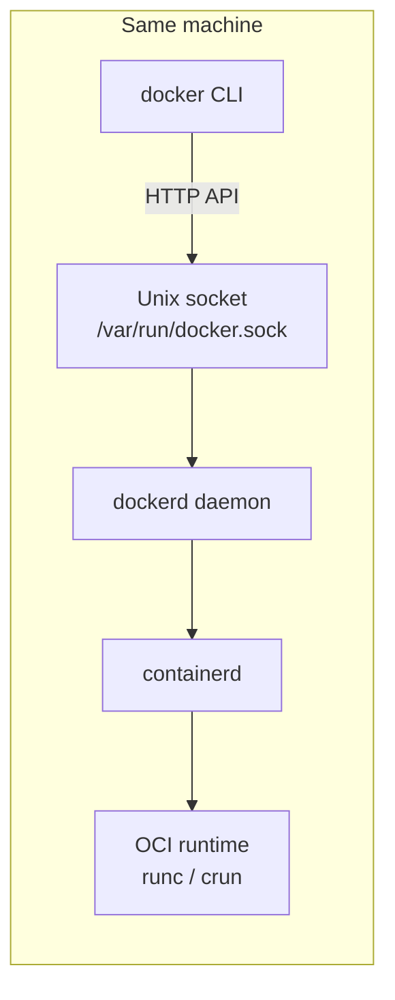
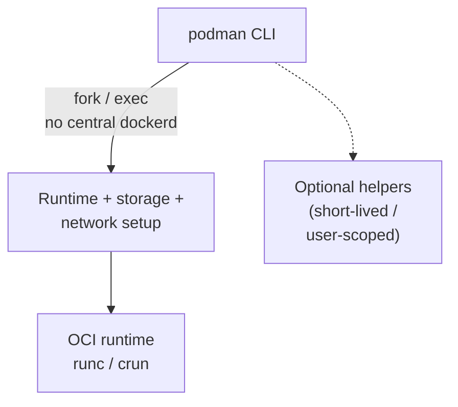
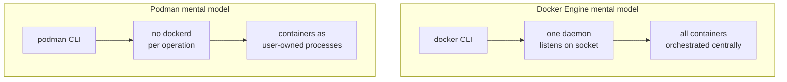

# Module 2 — Linux: Docker Engine and Podman CLI

## Learning outcomes

You can compare **Docker Engine** and **Podman** on Linux, describe **rootful vs rootless**, and know how clients talk to the daemon (or avoid one).

---

## 1. Docker Engine on Linux

**Docker Engine** is the server-side component: traditionally **`dockerd`** (daemon) working with **containerd** and a runtime (e.g. `runc`). The **`docker` CLI** is a client; it sends API requests to the daemon, usually via a **Unix socket** such as `/var/run/docker.sock`.

Typical properties:

- **Daemon-centric:** one long-running service manages objects (containers, networks, volumes).
- **Rootful by default on many installs:** the daemon runs as root; users in the `docker` group can talk to the socket (effectively **root-equivalent** on the host — treat membership as highly sensitive).
- **Ubiquitous docs and CI examples** use `docker` commands.

---

## 2. Podman CLI on Linux

**Podman** is often described as **daemonless**: the `podman` CLI can **fork/exec** the runtime stack without requiring `dockerd`. In practice, Podman may still use a **short-lived** or **user-scoped** service for some features (e.g. pasta networking on certain paths), but the mental model differs: **no central root-owned API socket** by default.

Important concepts:

- **Rootless Podman:** runs under your user, uses **user namespaces** so UID 0 in the container maps to your unprivileged UID on the host (mapping is configurable).
- **Compatibility layer:** `podman-docker` can provide a `docker` command alias — useful for scripts, with caveats for edge cases.
- **Pods:** Podman can group containers in **pods** (shared network namespace by default), closer to Kubernetes’ pod idea.

---

## 3. Side-by-side (conceptual)

| Topic | Docker Engine | Podman (typical) |
|--------|----------------|------------------|
| API / daemon | `dockerd`, Docker API | No `dockerd`; architecture differs |
| Root | Daemon rootful; socket access very powerful | Rootless-first story |
| Socket | `/var/run/docker.sock` well-known | No equivalent “one socket to rule them all” by default |
| Compose | `docker compose` (plugin; see Module 4) | `podman compose` / compose integrations (see Module 4) |
| Kubernetes-style | Not the CLI’s primary model | Pods, generates K8s YAML from pods (optional workflows) |

---

## 4. Security and ops notes (Linux)

1. **`docker` group** ≈ escalation risk; prefer **rootless** where possible or tight automation accounts.
2. **SELinux/AppArmor:** both ecosystems can integrate; failures often show up as permission denials on volumes — fix with labels/volume options, not blind `privileged`.
3. **cgroups:** rootless setups need cgroup delegation configured correctly on older distros.

---

## 5. When enterprises pick Engine vs Podman on Linux

- **Docker Engine** (CE packages or vendor builds) when teams want **maximum tutorial parity** and existing automation targets the Docker API.
- **Podman** when policy prefers **daemonless**, **rootless**, or **avoiding Docker’s subscription/licensing** footprint on servers (evaluation is organizational).
- **Both** may coexist **if** governance allows — but standardize image build and Compose to reduce drift.

---

## 6. Check your understanding

1. Why is access to `/var/run/docker.sock` considered sensitive?
2. What does “rootless” mean for Podman in one sentence?
3. Name one reason a team might keep Docker Engine on Linux despite Podman availability.
