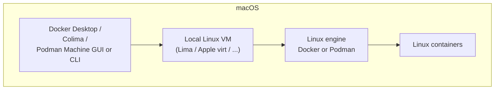
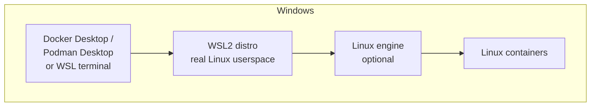
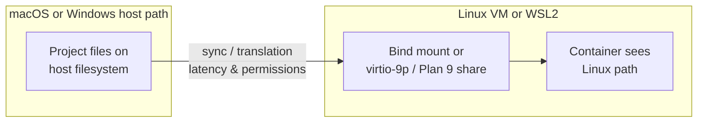

# Module 3 — macOS and Windows: where containers actually run

## Learning outcomes

You can explain **why** Docker/Podman on macOS and Windows depend on a **Linux environment**, and how **WSL2**, **Hyper-V**, and **Apple virtualization** fit in.

---

## 1. The core misconception to kill early

On **macOS** and **Windows**, a “Linux container” does **not** run on the **native** kernel like it does on Linux. Your `docker run` triggers work that executes inside a **Linux machine** boundary:

- a lightweight **VM**,
- **WSL2** (which is a Linux VM integrated into Windows),
- or a **remote** Linux builder/runner.

The CLI on macOS/Windows is mostly **remote control** of that Linux side (API, SSH, virtio, named pipes — implementation varies).

---

## 2. macOS: common backends

### Docker Desktop for Mac

- Runs a **Linux VM** using Apple’s virtualization stack (historically **HyperKit**/VM-related components; evolves with Apple Silicon).
- Bundles **Docker Engine** inside the VM, plus integrations (Kubernetes optional, filesystem sharing, HTTPS proxy options, SSO in enterprise editions).

### Podman Machine (Mac)

- **Podman Desktop** / `podman machine` spins up a Linux VM (“machine”) hosting Podman’s stack; the macOS CLI talks to that VM.

### Colima (**Co**ntainers on **Li** ma)

- Uses **Lima** to run a Linux VM locally; can expose **Docker** or **Podman** compatible endpoints (`docker.sock` forwarding, containerd-focused paths depending on setup/version).
- Popular when teams want **Docker CLI compatibility** **without Docker Desktop**.

### Remote Linux dev box / shared builder

- Many enterprises run **CI** and **approved** shared environments; laptops only orchestrate remotely. Same lesson: workloads execute on **Linux**.

---

## 3. Windows: common backends

### Docker Desktop for Windows

- Often uses **WSL2** as the Linux layer (recommended path in recent years), with integration to the Windows side.
- Older Hyper-V-backed “Linux containers” setups still exist in documentation; practically, **know your org’s standard**.

### Podman on Windows

- Typical pattern: **WSL2** Linux distro installs **Podman**; **Podman Desktop** orchestrates VMs similar to macOS workflows depending on release channel.
- Native Windows binaries exist but **hands-on curricula** usually standardize on **WSL2** because it mirrors production Linux closely.

### WSL2 in one sentence

> WSL2 runs a **real Linux kernel** in a lightweight VM tightly integrated with Windows; Linux containers naturally live **inside** that Linux world.

---

## 4. File system and performance pitfalls (cross-platform)

- **Bind mounts** cross OS boundaries (e.g. Windows/macOS host folder → Linux VM) can add **latency** and **permission translation** quirks.
- **Line endings**, **executable bits**, **inotify-heavy** watchers (frontend dev), and **SQLite on NFS-like shares** often surface as “works on Linux server, flaky on laptop.” Standard mitigation: clone inside Linux (WSL2 filesystem), Linux remote dev, or carefully tuned caches.

---

## 5. Check your understanding

1. On macOS, does the Darwin kernel natively enforce Linux container namespaces for your Alpine image? Explain.
2. What is one reason WSL2 is the default backbone for Docker Desktop workflows on Windows?
3. Give one non-Desktop approach for Docker-compatible CLI on Mac (**Colima**) and one for Podman-centric workflow (**Podman Machine**).
