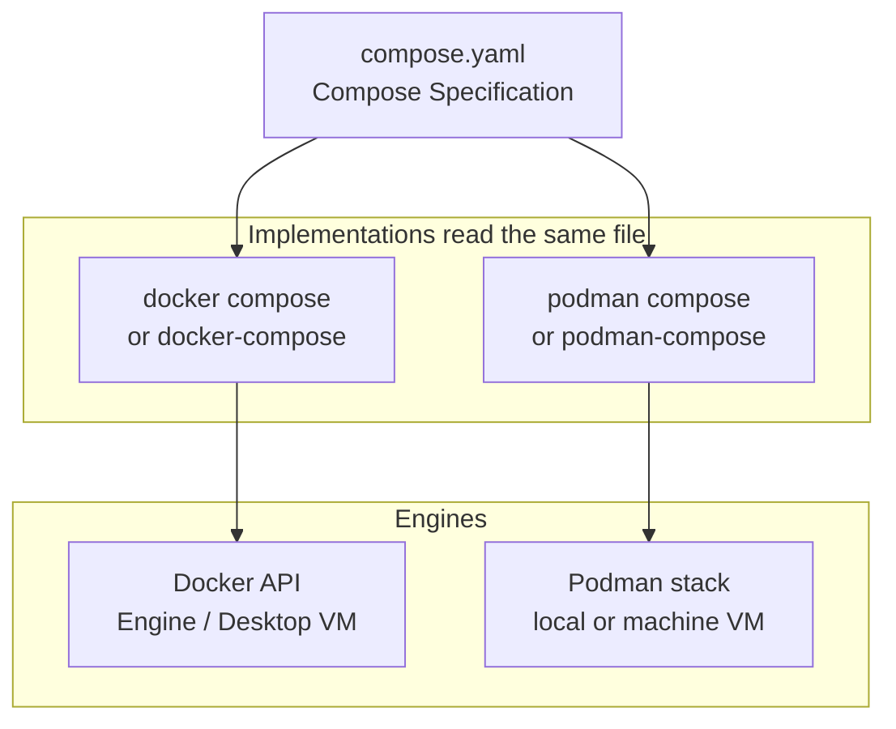
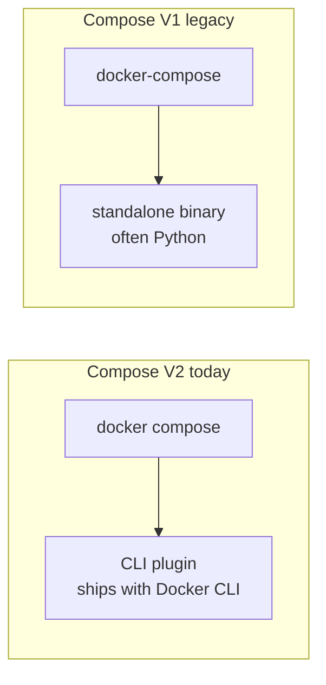

# Module 4 — Compose: `docker compose`, `docker-compose`, Podman

## Learning outcomes

You can distinguish **Compose file format**, **Compose Specification**, **Compose V2 plugin**, **`docker-compose` V1**, and Podman’s compose options—and know what typically breaks when switching engines.

---

## 1. What “Compose” means

- **Compose file** — usually `compose.yaml` / `docker-compose.yml`: declares **services**, **build** contexts, **ports**, **volumes**, **networks**, **depends_on**, healthchecks, etc.
- **Compose Specification** — the **vendor-neutral** spec for that YAML (evolved from Docker Compose file format v3+).
- **Implementation** — the **tool** that reads the file and talks to an engine API (Docker API, Podman’s API, etc.).

The file is **mostly portable**; the **engine features** and **network/volume semantics** are where differences appear.



---

## 2. `docker compose` (Compose V2, plugin)

Modern Docker CLI includes **`docker compose`** as a **CLI plugin** (Compose V2). It is the **supported** path today for Docker Desktop and Docker Engine installs that ship the plugin.

Characteristics:

- Subcommand style: `docker compose up`, `docker compose build`.
- Integrates with the same **Docker context** as `docker build` / `docker run`.
- Pulls images, creates project networks, orchestrates multi-container apps.

---

## 3. `docker-compose` (legacy standalone, V1)

Historically, **`docker-compose`** was a **Python** binary (Compose V1) invoked as a separate command. Many older tutorials still show it.

Today:

- **Prefer `docker compose`** for new work on Docker.
- Some CI images or older servers still install **`docker-compose`**; behavior and flags can differ slightly from V2.
- **Do not** mix naming in docs without explaining they are two **delivery methods** for “Compose on Docker.”

**Mnemonic:** hyphenated `docker-compose` = old standalone; space `docker compose` = plugin.



---

## 4. Podman: `podman compose` vs `podman-compose`

### `podman compose` (Podman’s integrated path)

Recent Podman releases expose **`podman compose`** to run Compose workloads using a **Compose implementation** wired to Podman (details depend on version: may shell out to an external binary or use bundled logic). Treat it as: **“Podman-native entry point for Compose files.”**

Check your version’s docs: `podman compose --help`.

### `podman-compose` (separate project)

**`podman-compose`** is (was) commonly a **Python**-based tool that translated Compose to `podman` commands. Some environments still use it.

**Practical guidance:**

- Standardize on **`podman compose`** when your Podman version supports it.
- If you inherit **`podman-compose`**, pin versions in requirements and test networking/volumes carefully.

---

## 5. Feature parity caveats (always test)

When moving **Docker Compose → Podman Compose**, watch for:

- **BuildKit** features and subtle `docker build` differences.
- **Named volumes** and **SELinux** labels (`:Z`, `:z`) on RHEL/Fedora.
- **Internal DNS** and **custom networks** (usually fine; edge cases exist).
- **Profiles**, **extends**, **platform:** fields — support varies by implementation version.
- **Compose Watch**, **secrets from Swarm**, **x-* extensions** — often Docker Desktop / Engine specific.

---

## 6. One Compose file, two engines (teaching pattern)

Keep **one** `compose.yaml` in repo; document **two** command paths:

```bash
# Docker
docker compose up -d

# Podman
podman compose up -d
```

CI should run the **approved** path for your org.

---

## 7. Check your understanding

1. Why is `docker compose` (space) not the same artifact as `docker-compose` (hyphen)?
2. What is one reason a Compose file might work on Docker but fail on Podman without changes?
3. Where would you look first to see if your Podman build supports `podman compose`?
