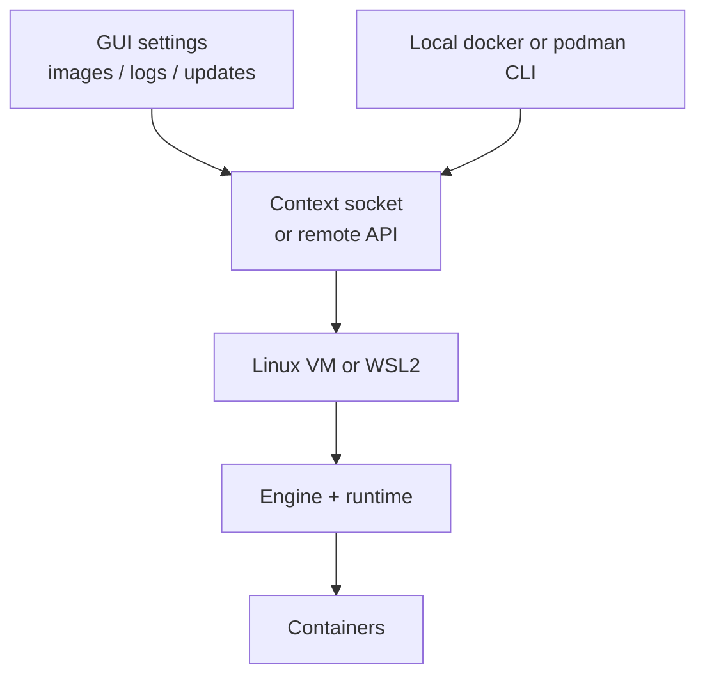

# Module 5 — Desktop products: Docker Desktop, Podman Desktop, Colima

## Learning outcomes

You can separate **“local Linux VM + engine”** from **GUI + policies + extras**, and place **Colima** correctly as **not** a full swap-in for every Desktop feature.

---

## 1. What a “Desktop” product usually bundles

Typical ingredients (exact mix varies by vendor and edition):

1. **Local Linux environment** (VM or WSL2) running the engine.
2. **CLI integration** (context, socket, credentials).
3. **GUI** for images, containers, settings, updates.
4. **Enterprise features** (SSO, policy, air-gap installers, support SLAs) — stronger in paid tiers.

**Colima** usually covers **CLI + VM + engine** without the full **Desktop GUI / enterprise suite** (compare your org’s checklist).

---

## 2. Docker Desktop

**Role:** Reference **developer experience** for many teams; tight integration on Mac/Win; optional Kubernetes; **Build Cloud** / Hub integrations in vendor ecosystem.

**Platform notes:**

- **macOS / Windows:** provides the Linux layer and Engine.
- **Linux:** Docker Desktop exists for some distros; many servers use **Engine packages** instead of Desktop.

**Licensing / policy:** larger companies may need **paid subscriptions** for Docker Desktop; some orgs **block** it and mandate alternatives. (Exact rules change — procurement reads current Docker subscription docs.)

---

## 3. Podman Desktop

**Role:** GUI and workflow layer atop **Podman**; can manage images, containers, pods, Kubernetes contexts (features evolve per release). On Mac/Win, it coordinates **Podman Machine**.

**Why teams pick it:**

- Aligns with **daemonless**/**rootless** Linux stories.
- Useful when **Docker Desktop** is not approved but a **GUI** is still wanted.

---

## 4. Colima

**Role:** **Lightweight** local Linux VM (via Lima) to run **containerd/Docker/Podman**-compatible tooling without Docker Desktop.

**Strengths:**

- Simple mental model for Mac users avoiding Desktop.
- Docker CLI compatibility via socket forwarding (common setups).

**Limits (honest):**

- Not a feature-for-feature **Docker Desktop** replacement (Kubernetes single-node, certain integrations, corporate device management features may differ or need extra setup).
- You still maintain **VM lifecycle** (`colima start`, upgrades, resource limits).

---

## 5. Choosing among them (decision sketch)

| Need | Often choose |
|------|----------------|
| Official Docker support + turnkey Mac/Win | Docker Desktop (if licensed/allowed) |
| GUI + Podman-first | Podman Desktop |
| Minimal local VM + `docker` CLI on Mac | Colima |
| Servers / CI | Engine or Podman packages on **Linux**, not Desktop |
| Enterprise blocks Desktop | Colima / Podman Machine / remote dev / approved VM image |

---

## 6. Check your understanding

1. Name two things Docker Desktop provides **besides** `docker run`.
2. Why is Colima classified as **infrastructure** more than a **enterprise device management** suite?
3. What does Podman Desktop still require on macOS for Linux containers to run?
