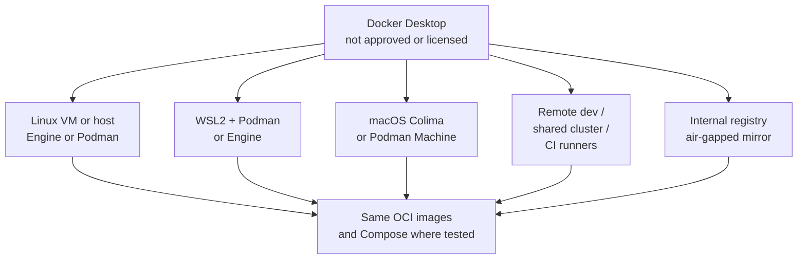
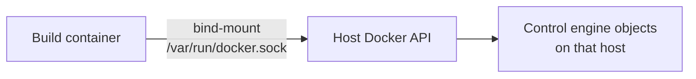

# Module 6 — Enterprise limitations and practical alternatives

## Learning outcomes

You can list **non-technical** reasons Docker Desktop is blocked, outline **approved patterns** (remote Linux, WSL2 + Podman, Colima, air-gapped mirrors), and avoid **security anti-patterns** (wildcard `sudo`, sharing `docker.sock` into containers carelessly).

---

## 1. Why Docker Desktop gets restricted

Common drivers (not mutually exclusive):

1. **Licensing and cost** at company scale.
2. **Software allowlists** — only packages from internal app stores.
3. **Security policy** — discomfort with automatic updates, vendor telemetry, or binary provenance.
4. **MDM / compliance** — need for **offline** installers, checksum verification, and **long-term pinned** versions.
5. **Duplication** — org already standardized on **Podman** or **Kubernetes** remote dev.

This is **normal**. Training should teach **concepts** and **portable** workflows (OCI images, Compose spec) so tooling swaps hurt less.

---

## 2. Patterns that work without Docker Desktop

### A. Linux workstation or VM

Run **Docker Engine** or **Podman** on a **company-approved** Linux VM (local or data center). CLI uses SSH context or remote socket (carefully firewalled + authenticated).

### B. WSL2 + Podman (or Engine) on Windows

Docker Desktop is not the only way to get a Linux userspace on Windows. A **supported** WSL2 distro with **Podman** or **Docker Engine** (if policy allows) can match server behavior closely.

### C. macOS + Colima or Podman Machine

**Colima** or **Podman Machine** supplies the Linux VM; developers use familiar CLIs. Validate **file sharing** and **corporate VPN** interactions.

### D. Remote development / shared dev cluster

**Dev containers**, **GitPod**, **Codespaces**, internal **OpenShift**/**Rancher** dev namespaces — the laptop is thin; builds run on **approved** infrastructure.

### E. Air-gapped registries

Enterprises mirror images to **internal registries**. Labs should use `registry.company.example` placeholders and mention **image signing** (Sigstore/cosign) where policy requires.

---

## 3. Socket mounting and CI secrets (short warning)

Mounting **`/var/run/docker.sock`** into a container gives that container **API-level control** over the engine (effectively host-level power in many setups). Some “Docker-in-Docker” patterns are replaced by:

- **rootless** builders,
- **Kaniko**/**Buildah** in CI,
- **Kubernetes** `Job` isolation.

Mention this in security reviews.

---

## 4. Standardization advice for platform teams

1. **One** golden path per OS (documented).
2. **Pin** versions in internal docs; **test** upgrades quarterly.
3. Prefer **rootless** where possible; if not, **audit** who can access engine APIs.
4. Teach **Compose spec** + **image labels** + **SBOM** expectations if supply-chain teams require them.

---

## 5. Check your understanding

1. Give two **non-security** reasons an org might ban Docker Desktop.
2. Why is WSL2 + Podman a credible alternative **for development** on Windows?
3. What is the risk of bind-mounting the Docker socket into a build container?
