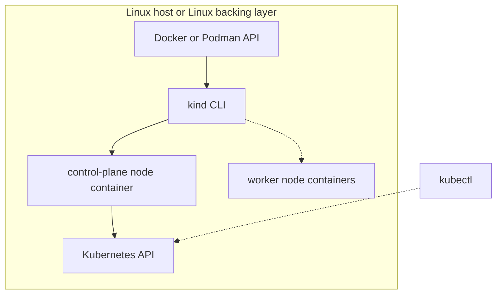
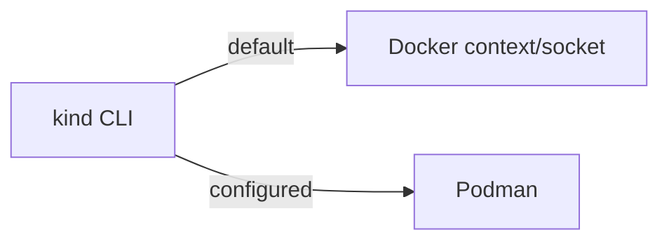

# Module 7 — Kubernetes locally with kind

## Learning outcomes

You can explain what **kind** does under the hood, **which execution path (provider)** it uses (**Docker** vs **Podman**), where kind clusters run on Linux/macOS/Windows, create and delete a local cluster, and know when kind is appropriate versus managed production Kubernetes.

---

## 1. What kind is

**[kind](https://kind.sigs.k8s.io/)** (**K**ubernetes **in** **D**ocker — historical name; Podman support exists on compatible setups) provisions a real Kubernetes cluster whose control-plane and worker "nodes" are ordinary Linux containers created through your engine API.



kind is excellent for **learning**, **CI**, and **conformance tests**; it is not a hardened production platform.

---

## 2. kind paths: Docker vs Podman provider

| Provider | Who kind talks to | Typical selection |
|----------|-------------------|-------------------|
| **Docker** | Docker CLI/API (`dockerd`) | Default when `docker` works. |
| **Podman** | Podman | Configured per kind Podman docs (provider flags/env can change by release). |



See upstream docs for current Podman provider details: [kind Podman guide](https://kind.sigs.k8s.io/docs/user/podman-using-kind/).

---

## 3. Where clusters run on each OS

| Your OS | Typical way to run kind | Where node containers execute |
|---------|--------------------------|-------------------------------|
| **Linux** | Docker Engine or Podman on host | Host Linux kernel |
| **macOS** | Docker Desktop or Colima-backed Docker CLI (or Podman machine path) | Linux VM behind Desktop/Colima/Podman machine |
| **Windows** | Docker Desktop (WSL2 backend) or inside a WSL2 distro with Linux engine | Linux backing layer (Desktop/WSL2), not native NT process model |

---

## 4. Prerequisites

- A working container engine (`docker info` or `podman info` succeeds).
- `kubectl` and `kind` installed.
- Enough free resources (single-node labs usually need ~2 GiB+ free RAM).

> Installation instructions in **[module 8 setup](08-setup-linux-macos-windows.md#6-kubernetes-with-kind-setup-after-your-engine-works)**.

---

## 5. Create and use a cluster

```bash
kind create cluster
kubectl cluster-info --context kind-kind
kubectl get nodes

kubectl create deployment nginx --image=nginx:stable-alpine
kubectl expose deployment nginx --port=80 --type=ClusterIP
kubectl get pods,svc

kind delete cluster
```

For multi-node configs and pinned node images, see [kind quick-start](https://kind.sigs.k8s.io/docs/user/quick-start/).

---

## 6. kind vs Docker Desktop Kubernetes

| Topic | kind | Docker Desktop Kubernetes |
|------|------|---------------------------|
| Node lifecycle | Explicit node containers on your engine | Embedded distro managed by Desktop |
| Portability | Works anywhere supported engine is available | Requires Desktop |
| Teaching clarity | Very explicit | More abstracted |

---

## 7. Enterprise cautions

- Treat laptop clusters as non-prod.
- Pin `kind`, `kubectl`, and node image versions.
- Mirror `kindest/node` internally if policy requires.

---

## 8. Related lab

- [lab-07-kubernetes-kind.md](../labs/lab-07-kubernetes-kind.md)

---

## 9. Check your understanding

1. What changes when kind uses Docker provider vs Podman provider?
2. On macOS, why must Docker context point to a live backend (Desktop/Colima)?
3. Why is kind great for learning but not equivalent to production Kubernetes?
