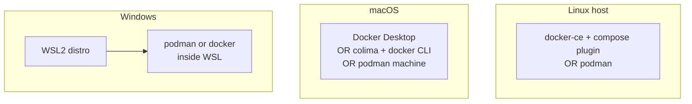

# Module 7 — Concrete setup: Linux, macOS, and Windows

## Learning outcomes

You can outline a **minimal working install** on each OS, know **which verification commands** prove the stack works, and find **official install docs** when your distro or policy differs.

---

## Before you start

1. **Use your organization’s package sources** (internal mirrors, MDM, golden images) when required — the commands below are **generic teaching examples**.
2. **Pick one primary engine** per machine (Docker Engine *or* Podman) to avoid socket and CLI confusion until you are comfortable.
3. After any install, run the **verification** block for that path.

---

## 1. Linux (bare metal or VM)

Linux runs containers **on the host kernel**. Typical choices: **Docker Engine (CE)** or **Podman**.

### 1a. Docker Engine + Compose plugin (recommended if you standardize on `docker`)

Official install guides (repos change over time):

- Docker documentation: search for **“Install Docker Engine on …”** for your distro (Ubuntu, Debian, Fedora, CentOS/RHEL-derived, etc.).

**Outline (Debian/Ubuntu-style)** — adapt names and keys to whatever Docker’s docs show today:

```bash
# Example pattern only — follow https://docs.docker.com/engine/install/ for exact steps
sudo apt-get update
# add Docker’s official apt repository per docs, then:
sudo apt-get install -y docker-ce docker-ce-cli containerd.io docker-buildx-plugin docker-compose-plugin
sudo systemctl enable --now docker
docker version
docker compose version
```

**Outline (Fedora / RHEL-style)** — use Docker’s **dnf** instructions from the same engine install guide, or your vendor’s approved package set.

**Post-install (important):**

- Adding your user to the `docker` group lets you run `docker` **without sudo**, but grants **effective root-level control via the daemon** ([module 02](02-linux-runtimes.md)). Many orgs restrict this.

```bash
# Optional — only if policy allows (then log out and back in)
sudo usermod -aG docker "$USER"

docker run --rm hello-world
```

### 1b. Podman + Compose (`podman compose`)

Fedora ships Podman prominently; Debian/Ubuntu use distro packages or your company mirror.

```bash
# Fedora / RHEL (examples)
sudo dnf install -y podman

# Debian / Ubuntu (examples)
sudo apt-get update
sudo apt-get install -y podman

podman version
podman run --rm quay.io/podman/hello
```

**Compose:**

```bash
podman compose version   # if your Podman build includes it
```

If `podman compose` is missing, your platform team may install **`podman-compose`** from an internal package index — see [module 04](04-compose.md).

**Rootless:** Podman often works rootless out of the box on current distros; if `podman info` shows `rootless: true`, you do **not** need `sudo` for routine pulls and runs (unless your admin disabled it).

### 1c. Linux verification checklist

| Check | Command |
|--------|---------|
| Engine responds | `docker version` or `podman version` |
| Run a tiny image | `docker run --rm hello-world` or `podman run --rm quay.io/podman/hello` |
| Compose (if used) | `docker compose version` or `podman compose version` |

---

## 2. macOS

macOS needs a **Linux VM** (or remote Linux) for Linux containers. Common **local** paths:

| Path | What you install (typical) |
|------|----------------------------|
| **Docker Desktop** | Docker’s Mac installer + GUI |
| **Colima + Docker CLI** | Homebrew (or manual) `colima`, `docker` CLI; Colima provides the engine |
| **Podman** | `podman` + `podman machine` (often via **Podman Desktop** or brew) |

### 2a. Docker Desktop (Mac)

1. Download the installer from Docker’s site (or your org’s software catalog).
2. Install, grant permissions when prompted (network, filesystem).
3. Start **Docker Desktop** from Applications and wait until it reports **running**.

```bash
docker version
docker run --rm hello-world
docker compose version
```

### 2b. Colima + Docker CLI (no Docker Desktop)

Requires [Homebrew](https://brew.sh/) or another approved install method:

```bash
brew install colima docker
colima start
docker context ls
docker context use colima    # select Colima when it is not already current (NAME column marked with *)
docker run --rm hello-world
docker compose version
```

**Context:** Colima exposes the engine as a **Docker context** named `colima`. After `colima start`, that context is often selected automatically; if `docker context ls` shows another context with `*` (for example leftovers from Docker Desktop), run **`docker context use colima`** so the CLI talks to Colima—not a stale or empty endpoint.

Stop when done (optional): `colima stop`. Resource tuning: `colima start --help` (CPU, memory, disk).

### 2c. Podman on Mac (Podman Machine)

```bash
brew install podman
podman machine init
podman machine start
podman run --rm quay.io/podman/hello
```

**Podman Desktop** (optional GUI): install from your org’s approved channel, then use it to manage machines and images — the underlying model is still **Linux in a VM**.

### 2d. macOS verification checklist

| Check | Command |
|--------|---------|
| CLI talks to backend | `docker version` or `podman version` |
| Run test container | `docker run --rm hello-world` or `podman run --rm quay.io/podman/hello` |
| Colima up | `colima status` |

---

## 3. Windows

Standard teaching path: **WSL2** with a Linux distro, then **Podman** or **Docker Engine** **inside that distro**. **Docker Desktop** is optional and policy-dependent.

### 3a. Enable WSL2 and install a distro (PowerShell / GUI)

**Outline:**

1. Enable WSL and install a default distro (Microsoft documents this as `wsl --install` on recent Windows, or optional features on older builds).
2. Prefer **WSL2** (not WSL1) for container work: `wsl --set-default-version 2`.
3. Install **Ubuntu** (or your org’s standard image) from the Microsoft Store or `wsl --install -d Ubuntu`.

Reboot if Windows asks you to.

### 3b. Podman inside WSL2 (Ubuntu example)

Open **your WSL terminal** (not PowerShell on the host, unless using `wsl.exe`).

```bash
sudo apt-get update
sudo apt-get install -y podman
podman version
podman run --rm quay.io/podman/hello
```

**Compose:** try `podman compose version`; if unavailable, use your org’s `podman-compose` package.

**Access from Windows:** browser `localhost` to published ports can differ by **Windows 11 WSL networking mode** — test with `curl` inside WSL first; see [lab 06](../labs/lab-06-windows-wsl-podman.md).

### 3c. Docker Engine inside WSL2 (optional, policy allowing)

Some teams install **`docker.io`** (distro package) or Docker’s official **Engine** steps **inside** the WSL distro — same caveats as Linux regarding the `docker` group.

```bash
# Example only — prefer https://docs.docker.com/engine/install/ubuntu/ or internal docs
sudo apt-get update
sudo apt-get install -y docker.io
sudo usermod -aG docker "$USER"
# new login session, then:
docker run --rm hello-world
```

### 3d. Docker Desktop for Windows (optional)

If licensed and allowed: install from Docker or your catalog, choose **WSL2 backend** when prompted, then from Windows or WSL:

```bash
docker version
docker run --rm hello-world
```

### 3e. Windows verification checklist

| Check | Where | Command |
|--------|--------|---------|
| WSL2 | PowerShell | `wsl -l -v` (VERSION column should show **2**) |
| Engine in Linux | WSL shell | `podman version` or `docker version` |
| Run test | WSL shell | `podman run --rm quay.io/podman/hello` or `docker run --rm hello-world` |

---

## 4. Quick reference: what to install where



---

## 5. Related labs

| OS focus | Lab |
|----------|-----|
| Linux Engine | [lab-02-docker-engine-linux.md](../labs/lab-02-docker-engine-linux.md) |
| Linux Podman | [lab-03-podman-linux.md](../labs/lab-03-podman-linux.md) |
| Compose | [lab-04-compose.md](../labs/lab-04-compose.md) |
| macOS Colima | [lab-05-mac-colima.md](../labs/lab-05-mac-colima.md) |
| Windows WSL | [lab-06-windows-wsl-podman.md](../labs/lab-06-windows-wsl-podman.md) |

---

## 6. Check your understanding

1. On macOS, why is `brew install docker` **not** enough without **Colima**, **Docker Desktop**, or another Linux backend?
2. Why is WSL **version 2** preferred over WSL1 for running Podman or Docker Engine?
3. What is one security reason your employer might **not** add your account to the `docker` group on Linux?
