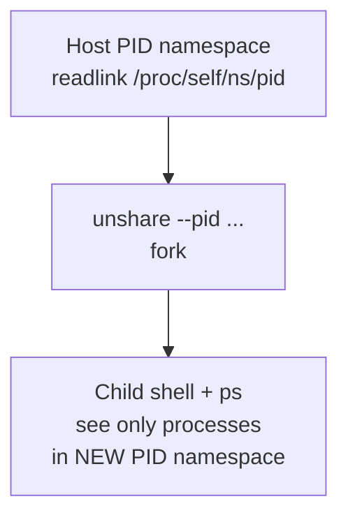

# Lab 1 — Linux namespaces without containers (conceptual bridge)

## Objective

See **isolation building blocks** on a real Linux host so later modules (Docker/Podman) feel like **orchestration** of features you already glimpsed.

## Prerequisites

- **Linux** shell (bare metal, VM, or WSL2 **inside** the Linux environment).
- Optional: `util-linux` package for `unshare` (standard on most distros).

## Safety

These commands create **short-lived** processes. Do not run random `unshare` tutorials with `--mount-proc` and bind mounts unless you understand cleanup. This lab stays minimal.

---

## Part A — Host vs namespace view (read-only)

```bash
# Your user and hostname on the host
id
hostname
readlink /proc/self/ns/pid
readlink /proc/self/ns/mnt
```

Note the **namespace inode** numbers (e.g. `pid:[4026531836]`). Different numbers later imply different namespaces.

---

## Part B — New PID namespace with `unshare`

```bash
sudo unshare --pid --fork --mount-proc sh -c 'echo Inside; ps -o pid,comm | head'
```

**What you should notice:** `ps` shows far fewer processes; PID numbers are **relative** to the new PID namespace. Type `exit` if an interactive shell remains open.

**Teaching point:** a container runtime sets up **several** namespaces together, plus cgroups, rootfs pivot, and capabilities — `unshare` is a **teaching slice**.



---

## Part C — cgroups awareness (observation)

If your system uses **cgroup v2**:

```bash
findmnt -no TARGET /sys/fs/cgroup
ls /sys/fs/cgroup | head
```

**Teaching point:** your future containers will appear as **cgroup leaves** under the delegated hierarchy; engines manage those paths for you.

---

## Discussion questions

1. Why does `--mount-proc` matter for `ps` inside a new PID namespace?
2. If namespaces only **hide** resources, what **additional** mechanism limits memory usage?

## Cleanup

No persistent state if you exited all `unshare` shells.
